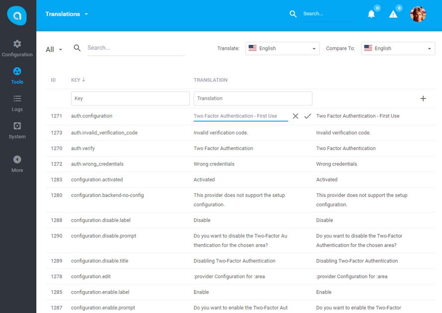

# Antares Translations Module

Translations is a module allowing administrator to manage the translations on the interface level. It provides handy tools for importing/exporting translations as files. The interface includes text comparison feature which makes it very easy to use even for non-technical person.

## Documentation

Antares Translations Module documentation [docs.antaresproject.io/php-framework/core_modules/translations](http://www.docs.antaresproject.io/php-framework/core-modules/translations).

Full Antares documentation can be found at [docs.antaresproject.io/php-framework](http://www.docs.antaresproject.io/php-framework).

## Changelog

Antares Translations changelog can be found in release notes [docs.antaresproject.io/php-framework/getting-started/changelog#translations](http://www.docs.antaresproject.io/php-framework/getting-started/changelog#translations).

You can find full Antares changelog in Antares Documentation [docs.antaresproject.io/php-framework/getting-started/changelog](http://www.docs.antaresproject.io/php-framework/getting-started/changelog).

## Issues

The issue list of this repo is **exclusively** for bug reports and feature requests.

Please follow [Issue Reporting Guide](http://www.docs.antaresproject.io/php-framework/getting-started/issues-reporting-guide) before opening an issue. Issues not following the guide will be closed without further investigation.

## Contribution

Please follow [Contribution Guide](http://www.docs.antaresproject.io/php-framework/getting-started/contribution-guide) before making a pull request.

## Community

* Twitter: @antaresproject
* Forum: (coming soon)
* Blog: (coming soon)
* Email: contact (at) antaresproject.io

## License

This software is released under the BSD 3-Clause License.

© 2017 INBS.Software.
